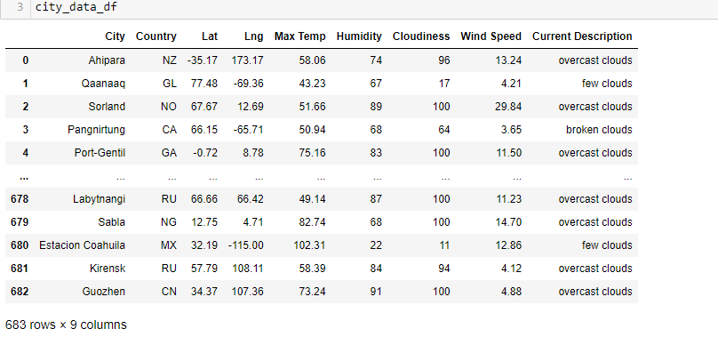
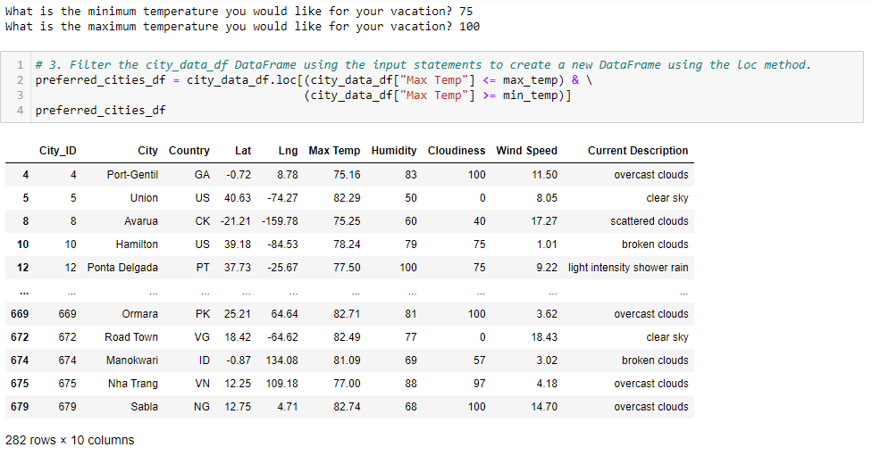
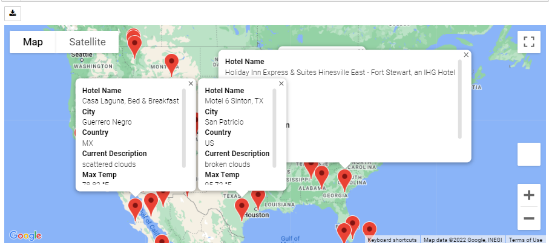
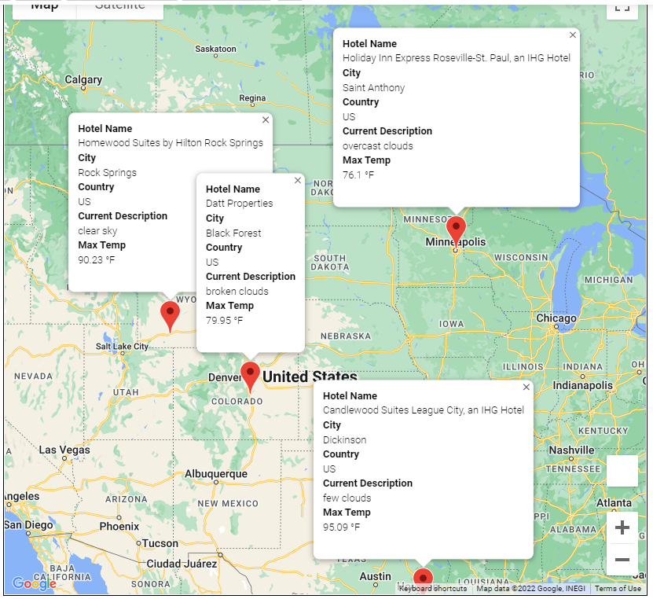
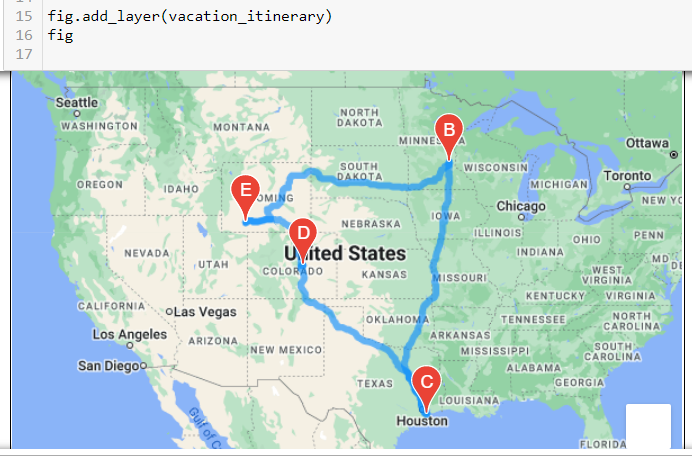

#World_Weather_Analysis
## Overview:
Using multiple API sources, create an app that allows users to filter through random locations based on their temperature range choices.
###  1.	Latitudes and Longitudes.
Generated a set of 2,000 random latitudes and longitudes, then adding the weather description to the weather data

###  2.	Filter the data for their weather preferences.
a temperature range was used to determine the list of best hotel options.

###  3.	Travel destinations. 
potential travel destinations and nearby hotels were identified.

###  4.	Cities list.
 four cities were chosen to create a travel itinerary.

###  5. Route
Finally, Using the Google Maps Directions API, a travel route between the four cities was created, as well as a marker layer map.

